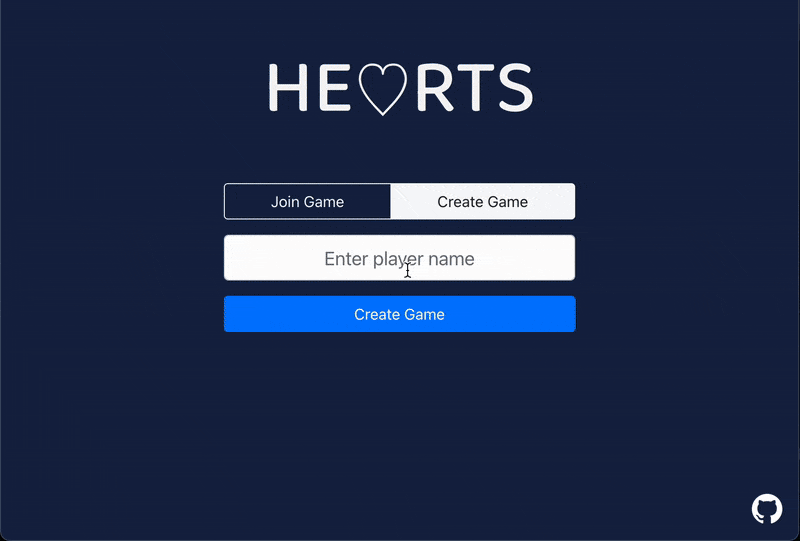

## Hearts

A online multiplayer implementation of the classic card game Hearts.

Built with:

- TypeScript
- React
- Socket.IO
- Express

Run Locally:

- `NODE_OPTIONS=--openssl-legacy-provider npm run build && npm start` from the root directory.

Demo GIF:

